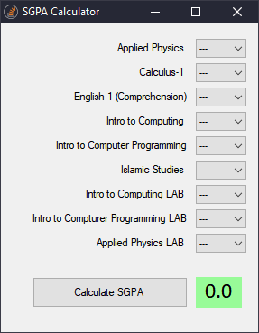

# Semester GPA Calculator
#### By Tehseen Sajjad

<p align="center"

# Installation
There is no installation. Just download the `exe`
- [Releases Page](https://github.com/tarpalantiri/semestergpa_calc/releases)
- Direct Download [Link](https://github.com/tarpalantiri/semestergpa_calc/releases/download/v2021.1.0/SGPA_Calc.exe)

# Usage
- Select all grades achieved
- Press `Calculate SGPA`

# Requirements
Any Windows 10 installation should be good.

On older version of Windows:
  - .NET Framework 4.6

# How does it work?
Each grade achieved has its own Points (as per University Policy)

Abasyn's grade points are

|Grade|Points|
|---|---|
|A|4.0|
|A-|3.7|
|B+|3.3|
|B|3.0|
|B-|2.7|
|C+|2.3|
|C|2.0|
|C-|1.7|
|D+|1.3|
|D|1.0|
|F|0.0|

1. Each acheived grade's point is multiplied with its corresponding Subjects credit hours. (Grade Weight)
2. SGPA = Sum(All Grade Weights) / Total Credit Hours

